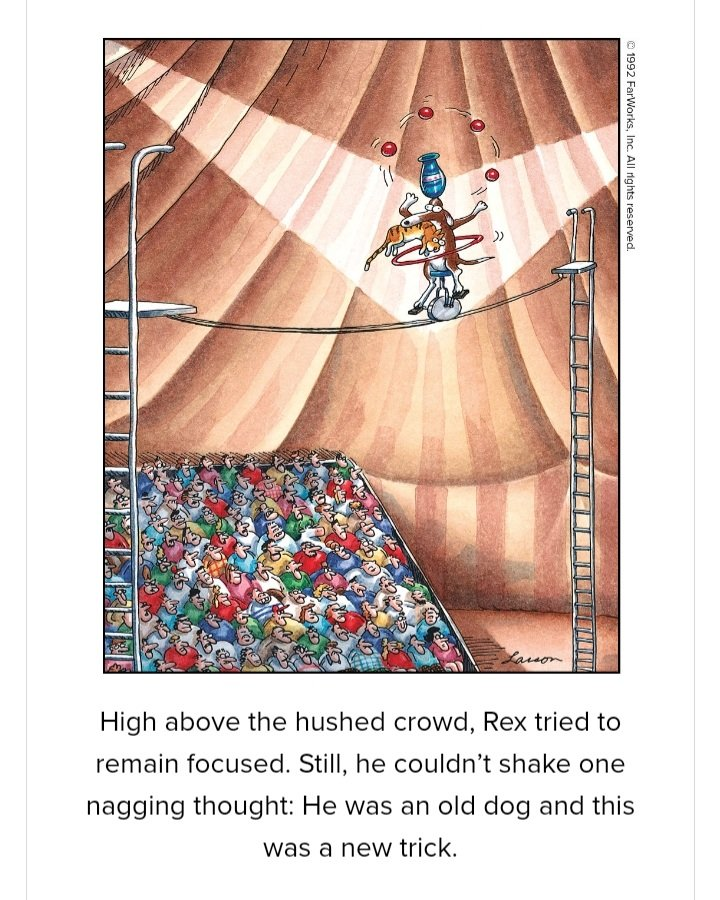

# CV

## Abstrakt

Jeg har et solidt kendskab til systemudvikling og programmering, hvor jeg har arbejdet med både frontend, backend samt mobile systemer. Jeg er god til at sætte mig ind i større, komplekse systemer. Jeg skriver velorganiseret, letlæselig og veldokumenteret kode. For særlig stabilitet er jeg ivrig tilhænger af tests, fx unit tests.

Som kollega er jeg let at have med at gøre og jeg har en udmærket humoristisk sans. Jeg har et roligt temperament, et godt overblik og arbejder koncentreret.

I  min fritid er jeg interesseret i at læse, og jeg hører en del podcasts og lydbøger. Jeg løber også en tur en gang imellem.

## Stamoplysninger

* Navn: Dennis Iversen
* Adresse: Tordenskjoldsgade 2, 1 th. 8700 Horsens.
* Tlf.: 40854015
* E-mail: <dennis.iversen@gmail.com>
* Github: <https://github.com/diversen>
* Facebook: <https://www.facebook.com/dennis.b.iversen>
* LinkedIn: <https://www.linkedin.com/in/diversen/>
* Født: 25 februar 1972
* Civil status: ugift, i forhold

## Erhvervserfaring

* 2017-2022. [Sharksmedia](https://sharksmedia.dk)
* 2015-2016. [Infogeist](http://infogeist.dk)
* 2012-2014. Book-holiday
* 2010-2012. Århus Kommune. IT administrator ved Børn og Unge Horsensvej
* 2007-2009. Arbejde ikke relateret til IT (Håndværk og andet)
* 2004-2006. Arbejde ved webbook
* 2003-2005. Freelance Programmør for bl.a. [pil.dk](https://www.pil.dk)

## Uddannelse

* 2001-2002. Webpublisher (Jensens Bureau). Halvt års kursus i webdesign
* 1996-2000. Bachelor i Dansk og Medievidenskab

## Kurser

* 2021 Kaggle (ML)

[Intermediate Machine Learning](https://www.kaggle.com/learn/certification/diversen/intermediate-machine-learning)

[Intro to Machine Learning](https://www.kaggle.com/learn/certification/diversen/intermediate-machine-learning)

* 2020: Deeplearning.ai

[Natural Language Processing in TensorFlow](https://www.coursera.org/account/accomplishments/certificate/KPLLNCBGESXM)

[Convolutional Neural Networks in TensorFlow](https://www.coursera.org/account/accomplishments/certificate/C5ZA6EZWJTLL)

[Introduction to TensorFlow for Artificial Intelligence, Machine Learning, and Deep Learning](https://www.coursera.org/account/accomplishments/certificate/85XNXYDMWMAF)

* 2017: Coursera

[Build a Modern Computer from First Principles](https://www.coursera.org/account/accomplishments/certificate/J3F7TS824X96)

## Sprog

* Flydende i Engelsk og Dansk (skrift og tale)
* Forstår det meste Tysk, Svensk og Norsk

## IT-egenskaber

* Web: PHP, SQL, HTML, Javascript, CSS (20 år >)
* System Administration: Unix og Linux (20 år >)
* Versionering: Git, CVS  (10 år > )
* Browser JS: Javascript, Jquery, Node Js (15 år > )
* Mobil App udvikling i Cordova, Ionic (JS) > 5 år
* CSS: LESS, SASS, SCSS, CSS3 (10 år > )
* Python, Tensor Flow, Django (5 år > )
* OS: Linux, OSX, Windows

## Udvalgte IT projekter / Referencer

### sharksmedia

* Mange projekter for større kunder.
* Web programming primært i PHP, Python og JS.
* Web-apps og mobile-apps.

Se <https://sharksmedia.dk> for et overblik over projekter.

### infogeist

* Flerbruger publiceringsplatform. Skriv i Markdown og udgiv som e-bog, PDF og HTML. Backend i PHP og MySQL. Frontend markdown-editor skrevet i Javascript. Opsat på en Azure cloud server.

### book-holiday

* Eksakte og komplekse søgninger af sommerhuse.
* Programmering af Drupal moduler

### Open source

Min github side:

<https://github.com/diversen>

Mine npm pakker:

<https://www.npmjs.com/~diversen>

Mine PHP pakker (packagist):

<https://packagist.org/users/diversen/packages/>

Emulering af hack computeren i Javascript:
(Fuldstændig emulering af CPU, ALU, RAM, ROM, skærm og keyboard i Javascript)

<https://github.com/diversen/hack-emulator-js>

